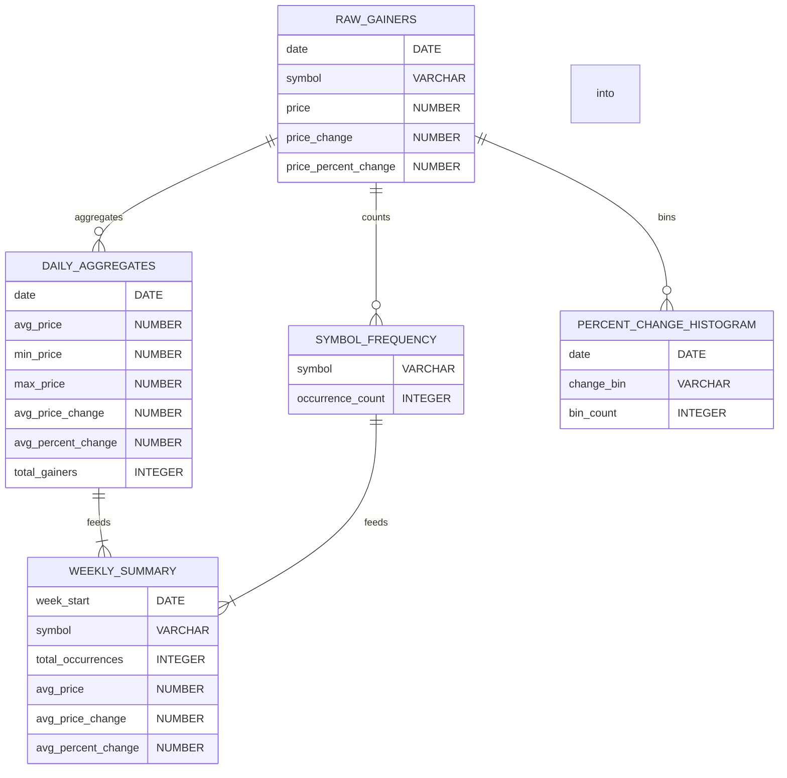

```mermaid
erDiagram
    RAW_GAINERS {
        date                   DATE
        symbol                 VARCHAR
        price                  NUMBER
        price_change           NUMBER
        price_percent_change   NUMBER
    }
    DAILY_AGGREGATES {
        date                   DATE
        avg_price              NUMBER
        min_price              NUMBER
        max_price              NUMBER
        avg_price_change       NUMBER
        avg_percent_change     NUMBER
        total_gainers          INTEGER
    }
    SYMBOL_FREQUENCY {
        symbol                 VARCHAR
        occurrence_count       INTEGER
    }
    PERCENT_CHANGE_HISTOGRAM {
        date                   DATE
        change_bin             VARCHAR
        bin_count              INTEGER
    }
    WEEKLY_SUMMARY {
        week_start             DATE
        symbol                 VARCHAR
        total_occurrences      INTEGER
        avg_price              NUMBER
        avg_price_change       NUMBER
        avg_percent_change     NUMBER
    }

    RAW_GAINERS          ||--o{ DAILY_AGGREGATES         : aggregates into
    RAW_GAINERS          ||--o{ SYMBOL_FREQUENCY         : counts into
    RAW_GAINERS          ||--o{ PERCENT_CHANGE_HISTOGRAM : bins into
    DAILY_AGGREGATES     ||--|{ WEEKLY_SUMMARY          : feeds
    SYMBOL_FREQUENCY     ||--|{ WEEKLY_SUMMARY          : feeds
```
